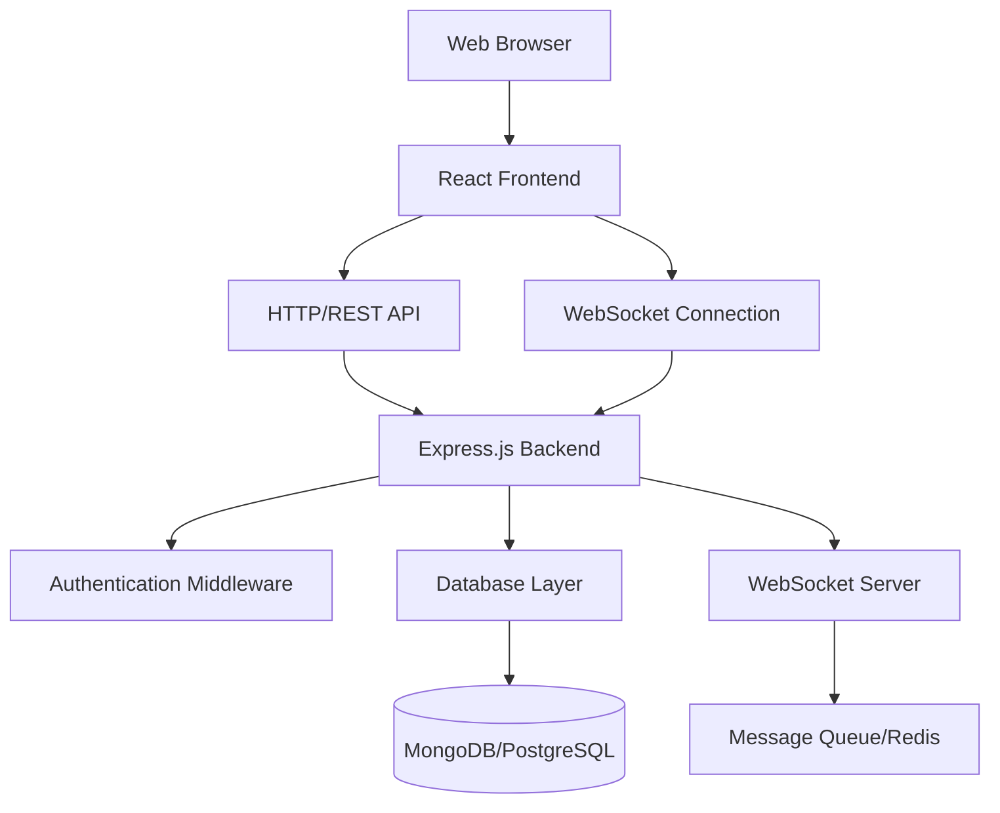

# Design Document

## Overview

The chatting website will be built as a full-stack web application with real-time messaging capabilities. The system uses a modern web architecture with a React frontend, Node.js/Express backend, WebSocket connections for real-time communication, and a database for persistent storage. The design prioritizes scalability, security, and API-first development to support future mobile applications.

## Architecture

### High-Level Architecture



### Technology Stack

**Frontend:**
- React.js with functional components and hooks
- Socket.io-client for WebSocket connections
- React Router for navigation
- Axios for HTTP requests
- CSS Modules or Styled Components for styling

**Backend:**
- Node.js with Express.js framework
- Socket.io for WebSocket server
- JWT for authentication tokens
- bcrypt for password hashing
- MongoDB or PostgreSQL for data persistence
- Redis for session storage and message queuing

## Components and Interfaces

### Frontend Components

#### Authentication Components
- `SignupForm`: User registration interface
- `SigninForm`: User login interface
- `AuthGuard`: Route protection component

#### Chat Components
- `ChatLayout`: Main application layout
- `UserSearch`: Search bar and results display
- `ChatWindow`: Message display and input interface
- `MessageList`: Scrollable message history
- `MessageInput`: Text input with send functionality

#### Utility Components
- `ProtectedRoute`: Authentication-required route wrapper
- `LoadingSpinner`: Loading state indicator
- `ErrorBoundary`: Error handling wrapper

### Backend API Endpoints

#### Authentication Routes
```
POST /api/auth/signup
POST /api/auth/signin
POST /api/auth/logout
GET /api/auth/verify
```

#### User Management Routes
```
GET /api/users/search/:userId
GET /api/users/profile
PUT /api/users/profile
```

#### Chat Routes
```
GET /api/chats/:userId
GET /api/chats/:chatId/messages
```

#### WebSocket Events
```
connection: User connects to chat
join_chat: User joins specific chat room
send_message: User sends message
receive_message: User receives message
user_typing: Typing indicator
disconnect: User disconnects
```

## Data Models

### User Model
```javascript
{
  _id: ObjectId,
  uniqueUserId: String (indexed, unique),
  username: String (required, unique),
  email: String (required, unique),
  passwordHash: String (required),
  createdAt: Date,
  lastActive: Date,
  isOnline: Boolean
}
```

### Chat Model
```javascript
{
  _id: ObjectId,
  participants: [ObjectId] (User references),
  createdAt: Date,
  lastMessage: {
    content: String,
    sender: ObjectId,
    timestamp: Date
  }
}
```

### Message Model
```javascript
{
  _id: ObjectId,
  chatId: ObjectId (Chat reference),
  sender: ObjectId (User reference),
  content: String (required),
  timestamp: Date,
  messageType: String (text, image, file),
  isRead: Boolean
}
```

### Session Model
```javascript
{
  _id: ObjectId,
  userId: ObjectId (User reference),
  token: String (JWT),
  createdAt: Date,
  expiresAt: Date,
  isActive: Boolean
}
```

## Error Handling

### Frontend Error Handling
- Global error boundary for React component errors
- HTTP error interceptors for API failures
- WebSocket connection error handling with reconnection logic
- Form validation with user-friendly error messages
- Loading states and error notifications

### Backend Error Handling
- Centralized error middleware for Express routes
- Input validation using middleware (e.g., express-validator)
- Database connection error handling
- WebSocket error event handling
- Rate limiting and abuse prevention
- Structured error responses with appropriate HTTP status codes

### Error Response Format
```javascript
{
  success: false,
  error: {
    code: "ERROR_CODE",
    message: "Human readable error message",
    details: {} // Additional error context
  }
}
```

## Testing Strategy

### Frontend Testing
- Unit tests for React components using Jest and React Testing Library
- Integration tests for user flows (signup, signin, messaging)
- WebSocket connection testing with mock servers
- End-to-end tests using Cypress for critical user journeys

### Backend Testing
- Unit tests for API endpoints using Jest and Supertest
- Database integration tests with test database
- WebSocket event testing
- Authentication and authorization testing
- API rate limiting and security testing

### Test Data Management
- Seed data for development and testing environments
- Database cleanup between test runs
- Mock external services and dependencies
- Test user accounts with known credentials

## Security Considerations

### Authentication Security
- Password hashing using bcrypt with salt rounds
- JWT tokens with appropriate expiration times
- Secure session management with HTTP-only cookies
- Password strength requirements and validation

### API Security
- CORS configuration for allowed origins
- Rate limiting to prevent abuse
- Input sanitization and validation
- SQL injection and NoSQL injection prevention
- XSS protection with content security policies

### WebSocket Security
- Authentication verification before WebSocket connection
- Message validation and sanitization
- Connection rate limiting
- Proper error handling without information leakage

## Performance Optimization

### Frontend Performance
- Code splitting and lazy loading for routes
- Message virtualization for large chat histories
- Debounced search input to reduce API calls
- Optimistic UI updates for better user experience

### Backend Performance
- Database indexing on frequently queried fields
- Connection pooling for database connections
- Message pagination to limit data transfer
- Redis caching for frequently accessed data
- WebSocket room management for efficient message broadcasting

## Deployment Architecture

### Development Environment
- Local development with hot reloading
- Docker containers for consistent environment
- Environment-specific configuration files
- Local database instances

### Production Environment
- Containerized deployment with Docker
- Load balancer for multiple backend instances
- Database clustering for high availability
- CDN for static asset delivery
- SSL/TLS encryption for all connections
- Environment variable management for secrets